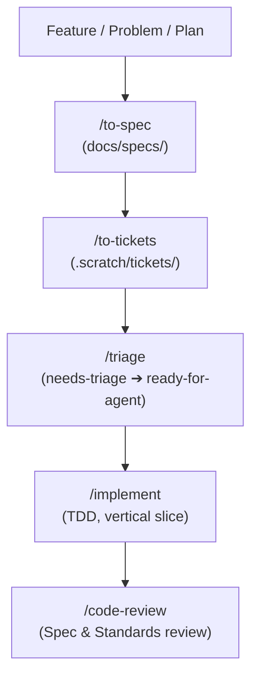

# Agent Instructions & Workflow Guide

This guide coordinates AI agent behavior with the **Matt Pocock Engineering Skill Suite** and repository conventions for Prostuti.

## Primary References
1. [`CONTEXT.md`](file:///home/almizan/Other%20Locations/workspace/Projects/hobby/prostuti/prostuti_app/CONTEXT.md) — System ubiquitous language, domain entities, and core invariants.
2. [`CONTEXT-MAP.md`](file:///home/almizan/Other%20Locations/workspace/Projects/hobby/prostuti/prostuti_app/CONTEXT-MAP.md) — Strategic DDD bounded contexts (`app/` client vs `backend/` service).
3. [`docs/adr/`](file:///home/almizan/Other%20Locations/workspace/Projects/hobby/prostuti/prostuti_app/docs/adr/) — Architectural Decision Records index.
4. [`backend/docs/backend.md`](file:///home/almizan/Other%20Locations/workspace/Projects/hobby/prostuti/prostuti_app/backend/docs/backend.md) — Backend architecture blueprint and module standards.
5. [`.scratch/tickets/README.md`](file:///home/almizan/Other%20Locations/workspace/Projects/hobby/prostuti/prostuti_app/.scratch/tickets/README.md) — Local ticket tracker and status registry.

---

## Matt Pocock Skill Workflow Integration

### 1. Spec Formulation (`/to-spec`)
Synthesize discussions and architectural seams into concrete specification documents under `docs/specs/` or ticket descriptions.

### 2. Ticket Slicing (`/to-tickets`)
Break specs into tracer-bullet tickets under `.scratch/tickets/` with explicit dependency chains (`blocked_by`, `blocks`).
- **Tracer Bullets:** Each ticket cuts vertically through necessary layers.
- **Context Window Sized:** Each ticket is scoped to execute comfortably within a single agent context session.
- **Explicit Blocking Edges:** Ensure parallelizable tickets are obvious.
- **Prefactor First:** Schedule mechanical prefactoring tickets before implementing feature additions.

### 3. Triage Lifecycle (`/triage`)
Move tickets through state transitions:
`needs-triage` ➔ `needs-info` ➔ `ready-for-agent` ➔ `in-progress` ➔ `done`.

### 4. Implementation (`/implement`)
- Follow test-driven development (`/tdd`) at public seams.
- Typecheck and run tests frequently in the sandbox.
- Adhere strictly to the bounded context rules:
  - Backend modules reside in `backend/src/app/modules/`.
  - Client modules reside in `app/feature/*` and `app/core/*`.

### 5. Architectural Decisions (`/domain-modeling`)
Document architectural shifts as ADRs under `docs/adr/` and keep ubiquitous language in `CONTEXT.md` up to date.

---

## Workspace Security Guardrails

1. **Directory Boundary:** Confine all file reads, creations, searches, and edits strictly to the active workspace directory (`prostuti_app`).
2. **Dependency Management:** Never run `pnpm install`, `pnpm add`, `npm install`, `yarn add`, or `bun add` without first asking the user for explicit approval.
3. **Git Safety:**
   - Read-only git queries (`git status`, `git diff`, `git log`) are freely permitted.
   - Mutating git commands (`git add`, `git commit`, `git push`, `git checkout`, `git reset`) require explicit user confirmation.
4. **Verification:** Run test suites and static analysis in the standard sandbox after modifying code.
