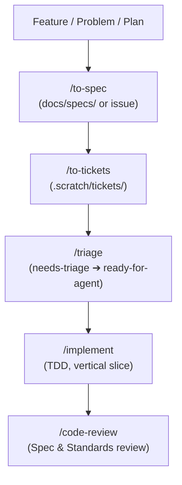

# Agent Instructions & Workflow Guide

This guide coordinates AI agent behavior with the **Matt Pocock Engineering Skill Suite** and repository conventions.

## Primary References
1. [`CONTEXT.md`](file:///home/almizan/Other%20Locations/workspace/Projects/App/KMP/Prostuti/CONTEXT.md) — Domain model, ubiquitous language, and system boundaries.
2. [`docs/project_guide.md`](file:///home/almizan/Other%20Locations/workspace/Projects/App/KMP/Prostuti/docs/project_guide.md) — Course scope, feature priorities, and build order.
3. [`docs/backend_design.md`](file:///home/almizan/Other%20Locations/workspace/Projects/App/KMP/Prostuti/docs/backend_design.md) — Data models, Exposed tables, API contracts, CSV schemas.
4. [`.agents/skills/prostuti-conventions/SKILL.md`](file:///home/almizan/Other%20Locations/workspace/Projects/App/KMP/Prostuti/.agents/skills/prostuti-conventions/SKILL.md) — Coding conventions, module constraints, what NOT to build.

---

## Matt Pocock Skill Workflow Integration

### 1. Spec Formulation (`/to-spec`)
Synthesize discussions and architectural seams into concrete specification documents under `docs/specs/` or ticket descriptions.

### 2. Ticket Slicing (`/to-tickets`)
Break specs into tracer-bullet tickets under `.scratch/tickets/` with explicit dependency chains (`blocked_by`, `blocks`).

### 3. Triage Lifecycle (`/triage`)
Move tickets through state transitions (`needs-triage` ➔ `needs-info` ➔ `ready-for-agent`).

### 4. Implementation (`/implement`)
- Follow test-driven development (`/tdd`) at public seams.
- Keep module changes within course constraints (only `core/model` is multiplatform; backend in `server`; plain Android modules).

### 5. Architectural Decisions (`/domain-modeling`)
Document architectural shifts as ADRs under `docs/adr/` and keep ubiquitous language in `CONTEXT.md` up to date.
